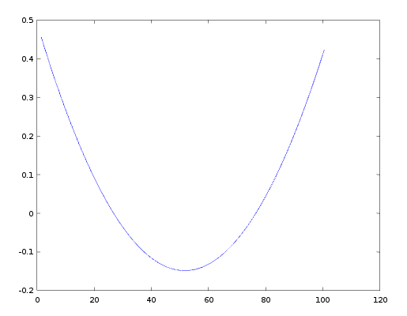

## GEP Curve Fitting

Gene Expression Programming

This program can run well(perfect) under 1 or 2 variable(s) condition.

#### I developed GEP algorithm with some changes:

- Added "Mutate Period": if the best fitness of chromosomes do not change during a period(the length can be set in Settings file), it will switch into a mutate period, which increases the mutation rate a lot.

- Added a threshold of fitnees, under which the process will terminate, or the evolution process will continue constantly.

- Smooth constants while its approximation works better.

#### Note

- if run the program on widonws, the output format will go wrong with character '\033'.

- the algorithm might coverge to a unexpected value sometimes, if so, re-run it.

- the algorithm works perfect when f(xi) contains no constant; the result with constants often has an error function e(xi), which generally won't converge to a stable value. 
Just like this:


#### Content

- ./GEP:    GEP core classes.

- ./Tools:  assistance tools for algorithm.

- ./Samples: some datas to train or test.

#### Sample

- input file: x0*x1+x0\x1+x0+x1.csv

- output:

 - chromosome: |+|*|+|X1|X0|X1|+|X0|/|X0|X1|

 - math expression: F( X0, X1 ) =  ( (X1*X0) + (X1+ (X0+ (X0/X1) ) ) )

## LICENSE
```
MIT LICENSE.
COPYRIGHT (C) 2016 Derek Liu
```

2016/04/18 by Derek Liu
